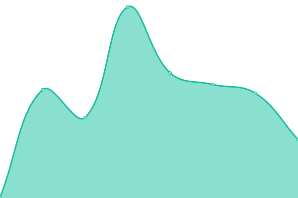
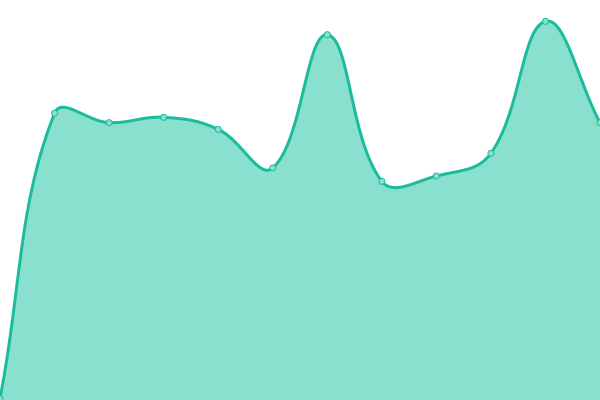
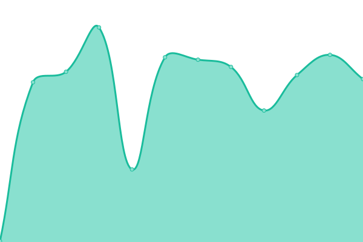
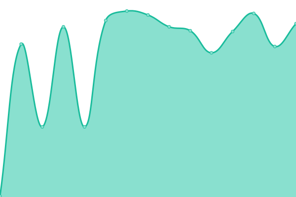

# [📈 Live Status](https://upptime.github.io/upptime): <!--live status--> **🟧 Partial outage**

This repository contains the open-source uptime monitor and status page for [Upptime](https://upptime.js.org), powered by [Upptime](https://github.com/upptime/upptime).

With [Upptime](https://upptime.js.org), you can get your own unlimited and free uptime monitor and status page, powered entirely by a GitHub repository. We use [Issues](https://github.com/upptime/upptime/issues) as incident reports, [Actions](https://github.com/30SAS/uptime/actions) as uptime monitors, and [Pages](https://upptime.github.io/upptime) for the status page.

<!--start: status pages-->
<!-- This summary is generated by Upptime (https://github.com/upptime/upptime) -->
<!-- Do not edit this manually, your changes will be overwritten -->
<!-- prettier-ignore -->
| URL | Status | History | Response Time | Uptime |
| --- | ------ | ------- | ------------- | ------ |
|  MS - links | 🟩 Up | [ms-links.yml](https://github.com/30SAS/uptime/commits/HEAD/history/ms-links.yml) | 

 352ms
     
 | 

<a href="https://statuskingo.treinta.co/history/ms-links">99.38%</a>
    

|  WEB - web.treinta.co | 🟩 Up | [web-web-treinta-co.yml](https://github.com/30SAS/uptime/commits/HEAD/history/web-web-treinta-co.yml) | 

 266ms
     
 | 

<a href="https://statuskingo.treinta.co/history/web-web-treinta-co">100.00%</a>
    

|  WEB - Treinta Shop | 🟩 Up | [web-treinta-shop.yml](https://github.com/30SAS/uptime/commits/HEAD/history/web-treinta-shop.yml) | 

 601ms
     
 | 

<a href="https://statuskingo.treinta.co/history/web-treinta-shop">100.00%</a>
    

|  WEB - treinta.co | 🟩 Up | [web-treinta-co.yml](https://github.com/30SAS/uptime/commits/HEAD/history/web-treinta-co.yml) | 

 304ms
     
 | 

<a href="https://statuskingo.treinta.co/history/web-treinta-co">100.00%</a>
    

|  MS - API-ORCHESTRATOR | 🟩 Up | [ms-api-orchestrator.yml](https://github.com/30SAS/uptime/commits/HEAD/history/ms-api-orchestrator.yml) | 

 509ms
     
 | 

<a href="https://statuskingo.treinta.co/history/ms-api-orchestrator">99.39%</a>
    

|  MS - TREINTA-API | 🟩 Up | [ms-treinta-api.yml](https://github.com/30SAS/uptime/commits/HEAD/history/ms-treinta-api.yml) | 

 603ms
     
 | 

<a href="https://statuskingo.treinta.co/history/ms-treinta-api">100.00%</a>
    

|  MS - LEDGER-API | 🟩 Up | [ms-ledger-api.yml](https://github.com/30SAS/uptime/commits/HEAD/history/ms-ledger-api.yml) | 

 231ms
     
 | 

<a href="https://statuskingo.treinta.co/history/ms-ledger-api">100.00%</a>
    

|  MS - PAYMENTS-API | 🟥 Down | [ms-payments-api.yml](https://github.com/30SAS/uptime/commits/HEAD/history/ms-payments-api.yml) | 

 231ms
     
 | 

<a href="https://statuskingo.treinta.co/history/ms-payments-api">0.00%</a>
    

|  MS - API-ADMIN | 🟩 Up | [ms-api-admin.yml](https://github.com/30SAS/uptime/commits/HEAD/history/ms-api-admin.yml) | 

 236ms
     
 | 

<a href="https://statuskingo.treinta.co/history/ms-api-admin">100.00%</a>
    

|  MS - API-ADMIN-INT | 🟩 Up | [ms-api-admin-int.yml](https://github.com/30SAS/uptime/commits/HEAD/history/ms-api-admin-int.yml) | 

 235ms
     
 | 

<a href="https://statuskingo.treinta.co/history/ms-api-admin-int">100.00%</a>
    

|  MS - HOME-API | 🟩 Up | [ms-home-api.yml](https://github.com/30SAS/uptime/commits/HEAD/history/ms-home-api.yml) | 

 240ms
     
 | 

<a href="https://statuskingo.treinta.co/history/ms-home-api">100.00%</a>
    

|  MS - USERS | 🟩 Up | [ms-users.yml](https://github.com/30SAS/uptime/commits/HEAD/history/ms-users.yml) | 

 227ms
     
 | 

<a href="https://statuskingo.treinta.co/history/ms-users">100.00%</a>
    

|  MS - STORES | 🟩 Up | [ms-stores.yml](https://github.com/30SAS/uptime/commits/HEAD/history/ms-stores.yml) | 

 225ms
     
 | 

<a href="https://statuskingo.treinta.co/history/ms-stores">100.00%</a>
    

|  MS - TRANSACTIONS | 🟩 Up | [ms-transactions.yml](https://github.com/30SAS/uptime/commits/HEAD/history/ms-transactions.yml) | 

 226ms
     
 | 

<a href="https://statuskingo.treinta.co/history/ms-transactions">100.00%</a>
    

|  MS - NOTIFICATIONS | 🟩 Up | [ms-notifications.yml](https://github.com/30SAS/uptime/commits/HEAD/history/ms-notifications.yml) | 

 223ms
     
 | 

<a href="https://statuskingo.treinta.co/history/ms-notifications">100.00%</a>
    

|  MS - SHOP | 🟩 Up | [ms-shop.yml](https://github.com/30SAS/uptime/commits/HEAD/history/ms-shop.yml) | 

 339ms
     
 | 

<a href="https://statuskingo.treinta.co/history/ms-shop">100.00%</a>
    

|  MS - PAYMENTS | 🟩 Up | [ms-payments.yml](https://github.com/30SAS/uptime/commits/HEAD/history/ms-payments.yml) | 

 223ms
     
 | 

<a href="https://statuskingo.treinta.co/history/ms-payments">100.00%</a>
    

|  MS - EX-INCOME | 🟩 Up | [ms-ex-income.yml](https://github.com/30SAS/uptime/commits/HEAD/history/ms-ex-income.yml) | 

 221ms
     
 | 

<a href="https://statuskingo.treinta.co/history/ms-ex-income">100.00%</a>
    

|  MS - MPOS | 🟩 Up | [ms-mpos.yml](https://github.com/30SAS/uptime/commits/HEAD/history/ms-mpos.yml) | 

 224ms
     
 | 

<a href="https://statuskingo.treinta.co/history/ms-mpos">100.00%</a>
    

|  MS - KYC | 🟩 Up | [ms-kyc.yml](https://github.com/30SAS/uptime/commits/HEAD/history/ms-kyc.yml) | 

 227ms
     
 | 

<a href="https://statuskingo.treinta.co/history/ms-kyc">100.00%</a>
    

|  MS - B2B | 🟩 Up | [ms-b2-b.yml](https://github.com/30SAS/uptime/commits/HEAD/history/ms-b2-b.yml) | 

 326ms
     
 | 

<a href="https://statuskingo.treinta.co/history/ms-b2-b">99.40%</a>
    

|  MS - WORKER-TRANSACTIONS | 🟩 Up | [ms-worker-transactions.yml](https://github.com/30SAS/uptime/commits/HEAD/history/ms-worker-transactions.yml) | 

 241ms
     
 | 

<a href="https://statuskingo.treinta.co/history/ms-worker-transactions">100.00%</a>
    

|  MS - WALLET | 🟩 Up | [ms-wallet.yml](https://github.com/30SAS/uptime/commits/HEAD/history/ms-wallet.yml) | 

 236ms
     
 | 

<a href="https://statuskingo.treinta.co/history/ms-wallet">100.00%</a>
    

|  MS - GAMIFICATION | 🟩 Up | [ms-gamification.yml](https://github.com/30SAS/uptime/commits/HEAD/history/ms-gamification.yml) | 

 231ms
     
 | 

<a href="https://statuskingo.treinta.co/history/ms-gamification">100.00%</a>
    

|  MS - HELP | 🟩 Up | [ms-help.yml](https://github.com/30SAS/uptime/commits/HEAD/history/ms-help.yml) | 

 231ms
     
 | 

<a href="https://statuskingo.treinta.co/history/ms-help">100.00%</a>
    

|  MS - WEBHOOK-MOVII-POS | 🟩 Up | [ms-webhook-movii-pos.yml](https://github.com/30SAS/uptime/commits/HEAD/history/ms-webhook-movii-pos.yml) | 

 225ms
     
 | 

<a href="https://statuskingo.treinta.co/history/ms-webhook-movii-pos">100.00%</a>
    

|  MS - PAYMENTS-DISBURSER | 🟩 Up | [ms-payments-disburser.yml](https://github.com/30SAS/uptime/commits/HEAD/history/ms-payments-disburser.yml) | 

 449ms
     
 | 

<a href="https://statuskingo.treinta.co/history/ms-payments-disburser">100.00%</a>
    

|  MS - WORKER-PAYMENTS-JUDGE | 🟩 Up | [ms-worker-payments-judge.yml](https://github.com/30SAS/uptime/commits/HEAD/history/ms-worker-payments-judge.yml) | 

 225ms
     
 | 

<a href="https://statuskingo.treinta.co/history/ms-worker-payments-judge">100.00%</a>
    

|  MS - PAYMENTS-GATEKEEPER | 🟩 Up | [ms-payments-gatekeeper.yml](https://github.com/30SAS/uptime/commits/HEAD/history/ms-payments-gatekeeper.yml) | 

 230ms
     
 | 

<a href="https://statuskingo.treinta.co/history/ms-payments-gatekeeper">100.00%</a>
    

|  MS - PAYMENTS-DATA-LOADER | 🟩 Up | [ms-payments-data-loader.yml](https://github.com/30SAS/uptime/commits/HEAD/history/ms-payments-data-loader.yml) | 

 226ms
     
 | 

<a href="https://statuskingo.treinta.co/history/ms-payments-data-loader">100.00%</a>
    

|  MS - PAYMENTS-ENTRY-MANAGER | 🟩 Up | [ms-payments-entry-manager.yml](https://github.com/30SAS/uptime/commits/HEAD/history/ms-payments-entry-manager.yml) | 

 227ms
     
 | 

<a href="https://statuskingo.treinta.co/history/ms-payments-entry-manager">100.00%</a>
    

|  MS - PAYMENTS-FEE-MANAGER | 🟩 Up | [ms-payments-fee-manager.yml](https://github.com/30SAS/uptime/commits/HEAD/history/ms-payments-fee-manager.yml) | 

 226ms
     
 | 

<a href="https://statuskingo.treinta.co/history/ms-payments-fee-manager">100.00%</a>
    

|  MS - WORKER-WALLET | 🟩 Up | [ms-worker-wallet.yml](https://github.com/30SAS/uptime/commits/HEAD/history/ms-worker-wallet.yml) | 

 220ms
     
 | 

<a href="https://statuskingo.treinta.co/history/ms-worker-wallet">100.00%</a>
    

|  MS - DATALAKE-MICROSERVICE | 🟩 Up | [ms-datalake-microservice.yml](https://github.com/30SAS/uptime/commits/HEAD/history/ms-datalake-microservice.yml) | 

 233ms
     
 | 

<a href="https://statuskingo.treinta.co/history/ms-datalake-microservice">100.00%</a>
    

|  MS - SKU-SERVICE | 🟩 Up | [ms-sku-service.yml](https://github.com/30SAS/uptime/commits/HEAD/history/ms-sku-service.yml) | 

 234ms
     
 | 

<a href="https://statuskingo.treinta.co/history/ms-sku-service">100.00%</a>
    

|  MS - PAYMENTS-FRAUD | 🟩 Up | [ms-payments-fraud.yml](https://github.com/30SAS/uptime/commits/HEAD/history/ms-payments-fraud.yml) | 

 224ms
     
 | 

<a href="https://statuskingo.treinta.co/history/ms-payments-fraud">100.00%</a>
    

|  MS - FINTECH-NOTIFICATIONS | 🟩 Up | [ms-fintech-notifications.yml](https://github.com/30SAS/uptime/commits/HEAD/history/ms-fintech-notifications.yml) | 

 224ms
     
 | 

<a href="https://statuskingo.treinta.co/history/ms-fintech-notifications">100.00%</a>
    

|  MS - PACO | 🟩 Up | [ms-paco.yml](https://github.com/30SAS/uptime/commits/HEAD/history/ms-paco.yml) | 

 228ms
     
 | 

<a href="https://statuskingo.treinta.co/history/ms-paco">100.00%</a>
    

|  MS - WORKER-POS | 🟩 Up | [ms-worker-pos.yml](https://github.com/30SAS/uptime/commits/HEAD/history/ms-worker-pos.yml) | 

 224ms
     
 | 

<a href="https://statuskingo.treinta.co/history/ms-worker-pos">100.00%</a>
    

|  MS - SYNC | 🟩 Up | [ms-sync.yml](https://github.com/30SAS/uptime/commits/HEAD/history/ms-sync.yml) | 

 230ms
     
 | 

<a href="https://statuskingo.treinta.co/history/ms-sync">100.00%</a>
    

|  MS - ENTRY-MANAGER | 🟩 Up | [ms-entry-manager.yml](https://github.com/30SAS/uptime/commits/HEAD/history/ms-entry-manager.yml) | 

 228ms
     
 | 

<a href="https://statuskingo.treinta.co/history/ms-entry-manager">100.00%</a>
    

|  MS - AUTHENTICATION | 🟩 Up | [ms-authentication.yml](https://github.com/30SAS/uptime/commits/HEAD/history/ms-authentication.yml) | 

 231ms
     
 | 

<a href="https://statuskingo.treinta.co/history/ms-authentication">100.00%</a>
    

|  MS - LOGISTICS | 🟥 Down | [ms-logistics.yml](https://github.com/30SAS/uptime/commits/HEAD/history/ms-logistics.yml) | 

 235ms
     
 | 

<a href="https://statuskingo.treinta.co/history/ms-logistics">0.00%</a>
    

|  MS - WALLET-GAMIFICATION | 🟩 Up | [ms-wallet-gamification.yml](https://github.com/30SAS/uptime/commits/HEAD/history/ms-wallet-gamification.yml) | 

 228ms
     
 | 

<a href="https://statuskingo.treinta.co/history/ms-wallet-gamification">100.00%</a>
    

|  MS - CHECKOUT | 🟩 Up | [ms-checkout.yml](https://github.com/30SAS/uptime/commits/HEAD/history/ms-checkout.yml) | 

 221ms
     
 | 

<a href="https://statuskingo.treinta.co/history/ms-checkout">100.00%</a>
    

<!--end: status pages-->

[**Visit our status website →**](https://upptime.github.io/upptime)

## 📄 License

- Powered by: [Upptime](https://github.com/upptime/upptime)
- Code: [MIT](./LICENSE) © [Upptime](https://upptime.js.org)
- Data in the `./history` directory: [Open Database License](https://opendatacommons.org/licenses/odbl/1-0/)
