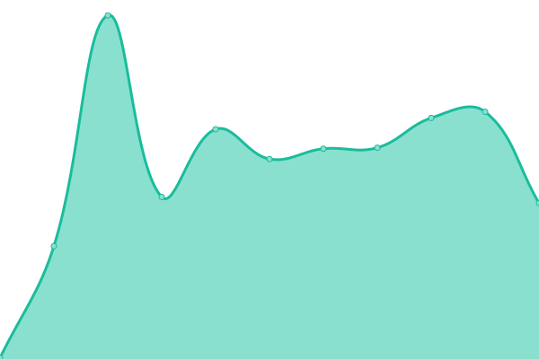

# [📈 Live Status](https://upptime.github.io/upptime): <!--live status--> **🟧 Partial outage**

This repository contains the open-source uptime monitor and status page for [Upptime](https://upptime.js.org), powered by [Upptime](https://github.com/upptime/upptime).

With [Upptime](https://upptime.js.org), you can get your own unlimited and free uptime monitor and status page, powered entirely by a GitHub repository. We use [Issues](https://github.com/upptime/upptime/issues) as incident reports, [Actions](https://github.com/30SAS/uptime/actions) as uptime monitors, and [Pages](https://upptime.github.io/upptime) for the status page.

<!--start: status pages-->
<!-- This summary is generated by Upptime (https://github.com/upptime/upptime) -->
<!-- Do not edit this manually, your changes will be overwritten -->
<!-- prettier-ignore -->
| URL | Status | History | Response Time | Uptime |
| --- | ------ | ------- | ------------- | ------ |
|  MS - api orchestrator | 🟩 Up | [ms-api-orchestrator.yml](https://github.com/30SAS/uptime/commits/HEAD/history/ms-api-orchestrator.yml) | 

 256ms
     
 | 

<a href="https://statuskingo.treinta.co/history/ms-api-orchestrator">100.00%</a>
    

|  MS - B2B | 🟩 Up | [ms-b2-b.yml](https://github.com/30SAS/uptime/commits/HEAD/history/ms-b2-b.yml) | 

 273ms
     
 | 

<a href="https://statuskingo.treinta.co/history/ms-b2-b">100.00%</a>
    

|  MS - delivery | 🟩 Up | [ms-delivery.yml](https://github.com/30SAS/uptime/commits/HEAD/history/ms-delivery.yml) | 

 943ms
     
 | 

<a href="https://statuskingo.treinta.co/history/ms-delivery">100.00%</a>
    

|  kyc | 🟩 Up | [kyc.yml](https://github.com/30SAS/uptime/commits/HEAD/history/kyc.yml) | 

 229ms
     
 | 

<a href="https://statuskingo.treinta.co/history/kyc">100.00%</a>
    

|  MS - ex-income | 🟩 Up | [ms-ex-income.yml](https://github.com/30SAS/uptime/commits/HEAD/history/ms-ex-income.yml) | 

 198ms
     
 | 

<a href="https://statuskingo.treinta.co/history/ms-ex-income">100.00%</a>
    

|  MS - shop | 🟩 Up | [ms-shop.yml](https://github.com/30SAS/uptime/commits/HEAD/history/ms-shop.yml) | 

 322ms
     
 | 

<a href="https://statuskingo.treinta.co/history/ms-shop">100.00%</a>
    

|  MS - notifications | 🟥 Down | [ms-notifications.yml](https://github.com/30SAS/uptime/commits/HEAD/history/ms-notifications.yml) | 

 5071ms
     
 | 

<a href="https://statuskingo.treinta.co/history/ms-notifications">99.81%</a>
    

|  MS - transactions | 🟩 Up | [ms-transactions.yml](https://github.com/30SAS/uptime/commits/HEAD/history/ms-transactions.yml) | 

 194ms
     
 | 

<a href="https://statuskingo.treinta.co/history/ms-transactions">100.00%</a>
    

|  MS - stores | 🟩 Up | [ms-stores.yml](https://github.com/30SAS/uptime/commits/HEAD/history/ms-stores.yml) | 

 247ms
     
 | 

<a href="https://statuskingo.treinta.co/history/ms-stores">100.00%</a>
    

|  MS - users | 🟩 Up | [ms-users.yml](https://github.com/30SAS/uptime/commits/HEAD/history/ms-users.yml) | 

 202ms
     
 | 

<a href="https://statuskingo.treinta.co/history/ms-users">100.00%</a>
    

|  MS - links | 🟩 Up | [ms-links.yml](https://github.com/30SAS/uptime/commits/HEAD/history/ms-links.yml) | 

 240ms
     
 | 

<a href="https://statuskingo.treinta.co/history/ms-links">100.00%</a>
    

|  WEB - web.treinta.co | 🟩 Up | [web-web-treinta-co.yml](https://github.com/30SAS/uptime/commits/HEAD/history/web-web-treinta-co.yml) | 

 454ms
     
 | 

<a href="https://statuskingo.treinta.co/history/web-web-treinta-co">100.00%</a>
    

|  WEB - Treinta Shop | 🟩 Up | [web-treinta-shop.yml](https://github.com/30SAS/uptime/commits/HEAD/history/web-treinta-shop.yml) | 

 579ms
     
 | 

<a href="https://statuskingo.treinta.co/history/web-treinta-shop">100.00%</a>
    

|  WEB - treinta.co | 🟩 Up | [web-treinta-co.yml](https://github.com/30SAS/uptime/commits/HEAD/history/web-treinta-co.yml) | 

 464ms
     
 | 

<a href="https://statuskingo.treinta.co/history/web-treinta-co">100.00%</a>
    

<!--end: status pages-->

[**Visit our status website →**](https://upptime.github.io/upptime)

## 📄 License

- Powered by: [Upptime](https://github.com/upptime/upptime)
- Code: [MIT](./LICENSE) © [Upptime](https://upptime.js.org)
- Data in the `./history` directory: [Open Database License](https://opendatacommons.org/licenses/odbl/1-0/)
